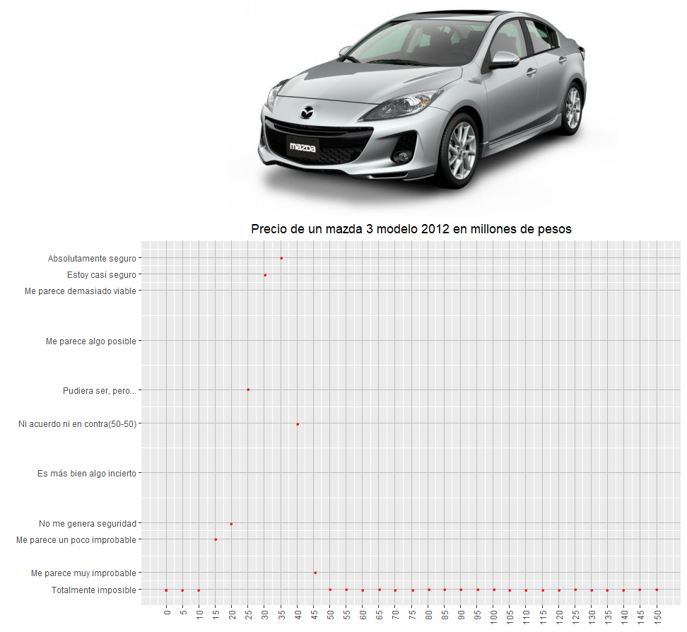
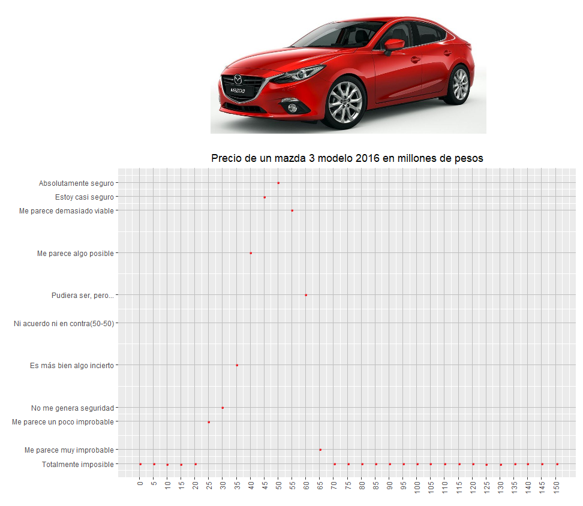
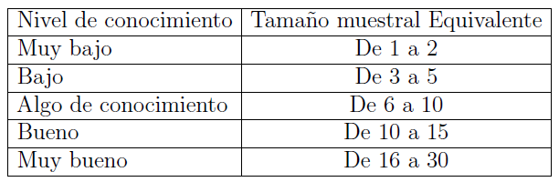

```{r setup, include=FALSE}
knitr::opts_chunk$set(echo = TRUE, warning = FALSE, message = FALSE)
```

<center>

<h2>

Introducción

</h2>

</center>

El auge de la compra y venta de los carros de segunda, es decir carros usados o semi nuevos ha tomado un gran impacto en la actualidad; a medida que pasan los años se ha vuelto una de las alternativas más viables para las personas interesadas en un automóvil, dado que manejan precios más favorables (ahorrar y pagar es más accesible) que los carros nuevos y en muchos casos estos pueden ser conseguidos en estados muy óptimos, además que una gran ventaja de comprar un carro usado es que, eventualmente, puedes venderlo en los próximos años por casi la misma cantidad que pagaste por él .

A partir del impacto que se ha destacado en la sociedad que es comprar y vender carros de segunda nace la motivación de plantear un modelo que estudie los precios de los carros través de los años, es decir cual es el precio promedio de una referencia de carro de un año determinado comparado con los demás años (Ej: cuánto aumenta el precio de un carro por ser modelo 2014 comparado con el del año anterior 2013), pero dado que los precios de carros pueden variar mucho de una marca a otra se toma la decisión de concentrarse en un marca en particular de automóvil que es el mazda3, el cual es un carro de gama media muy comercial, además de ser un carro que al público en general le atrae por las buenas características que este posee, por otro lado, el mazda 3 lleva muchos años en el mercado y sigue siendo un carro que actualmente sigue actualizando sus modelos.

Para realizar este estudio se decide utilizar técnicas basadas en la estadística Bayesiana, la cual aparte de necesitar una muestra de los precios de carros, realiza la construcción de una distribución a priori de los precios de los carros basados en el conocimiento que tiene un experto en el área frente a este tema que se quiere estudiar.

## Marco teórico

**¿Por qué se eligió el Mazda 3 para el estudio?**

El Mazda 3 es sin lugar a dudas uno de los autos más populares de la marca nipona (Japón). Su diseño, versatilidad, rendimiento y tecnología, lo han convertido en uno de los vehículos favoritos de los conductores. Por estas razones no es sorprendente que muchos conductores busquen a diario en Internet opciones de Mazda 3 usados que puedan adquirir a un precio asequible.

El Mazda 3 de segunda generación que comprende los modelos 2008 a 2012, es uno de los ejemplos de autos usados que puede ser una excelente opción de compra, pese a tener poco más de una década encima, no significa que sea un auto viejo, o peor aún, que no posea un buen rendimiento, aunque claro, eso también dependerá del uso que le haya dado cada dueño.

Es por todos esos atributos que esta generación del Mazda3 es considerada como una de las mejores ofertas disponibles hoy en día en el mercado de los autos usados o seminuevos, además de aportar la confiabilidad y durabilidad que caracteriza a los productos de Mazda. Ya que el Mazda 3 es un modelo muy comercial, el cual ha ganado varios premios lo convierte en un carro fácil de reconocer y encontrar en el mercado, sus precios son accesibles y presenta un diseño atractivo, por esas razones se decide estudiar el precio promedio de este vehículo, por otro lado, el experto confirma que posee conocimiento en este carro y es de su agrado.

**Lemas dados por la empresa MAZDA:** "El potencial humano y las cosas increíbles que hacen las personas son la fuente de nuestra inspiración, por eso hacemos parte de la grandeza en su camino con un vehículo capaz de encender sus sentidos, con un diseño mundialmente galardonado y creado para darles una experiencia de conducción en perfecta armonía."

AVANZA CON TU GRANDEZA "Avanzar: esa es la palabra que le da vida a nuestro propósito de impulsar la grandeza humana kilómetro a kilómetro con tal dedicación que la tecnología, el diseño y la ingeniería se armonizan a la perfección para respaldar tu camino."

<br>

<h3>

<center>

Especificaciones técnicas del carro

</center>

</h3>

<br>

**Contextualización del mazda 3**

<center>


</center>

<br>

El Mazda 3 es un coche perteneciente al segmento C fabricado por la marca japonesa de automóviles Mazda. Se construye desde 2003 , el conocido entonces como Mazda 323 tuvo como sustituto a un vehículo que tomó el nombre del Mazda 3, aunque en otros mercados como Japón se le conoce como Mazda Axela. El mazda 3 se coloca entre el Mazda 2 y el Mazda 6. La primera y la segunda generación están relacionadas tecnológicamente con el Ford Focus y el Volvo S40/V50 pues comparten plataforma.

El Mazda 3 ha sido bien recibido en muchos mercados. En el 2004, como modelo recién estrenado, fue el tercer automóvil mejor vendido en Canadá. El 8 de septiembre de 2006, Mazda anunció a la prensa que había producido 1 millón de unidades del Mazda 3, convirtiéndolo en su modelo más vendido. Es un récord que Mazda lograra esa cifra en tan corto periodo. En Colombia, a pesar de que su producción local cesó para el modelo 2014, siguió estando en la lista de 10 más vendidos en 2017, proveniente de México.

Un Mazda 3 de segunda generación para el año modelo 2009 se presentó a finales de 2008, con el sedán estrenado en el Salón del Automóvil de Los Ángeles y el hatchback en el Salón del Automóvil de Bolonia . Para el año modelo 2012, Mazda comenzó a ofrecer el Mazda 3 con su tecnología Skyactiv recientemente desarrollada , que incluye una carrocería más rígida, un nuevo motor de inyección directa y una nueva transmisión de 6 velocidades.

En enero de 2019 el Mazda3 se convirtió en el vehículo más rápidamente vendido de Mazda, con unas ventas acumuladas de más de 6 millones de unidades.

El Mazda3 ha recibido más de 130 premios en su vida comercial entre los que se destacan el galardón de diseño Autobild (2009), uno de los más reconocidos en Europa, que recogió la opinión de 200 mil lectores de la revista en 27 países. Ellos eligieron al Mazda3 como el modelo más atractivo del segmento de vehículos compactos. Por su parte la revista JD Power lo calificó como el modelo mejor vendido en la encuesta de satisfacción del consumidor en el 2011 después de ser el compacto número 1 en el 2010. Adicional a estos premios, recibió alrededor de 50 títulos como "vehículo del año" en diferentes países alrededor del mundo.

<br>

**Generaciones de carros del mazda 3**

<br>

<h2>

Primera generación (2003-2008)

</h2>

<hr>

<center>

{width="30%"} {width="30%"} {width="30%"}

</center>

<br>

La primera generación se convirtió en un éxito de ventas en diferentes mercados del mundo en los que obtuvo el primer lugar entre los más vendidos y también recibió múltiples reconocimientos por su diseño. Esto se reflejó en que el 8 de septiembre de 2006, Mazda anunciará la producción de la unidad 1 millón de este modelo, todo un récord en tan corto tiempo.

El Mazda3 está basado en la plataforma C1 global de Ford, compartida con el Ford Focus europeo y el Volvo S40 de la época. Como se vio inicialmente con el automóvil concepto MX-Sportif, el Mazda3 estuvo disponible en dos estilos de carrocería, un fastback cuatro puertas sedán, comercializado como un "cuatro puertas cupé" en Europa, y un cinco puertas hatchback, comercializado como versión Sport en Canadá, Japón y en los Estados Unidos.

<br>

<h2>

Segunda generación (2008-2013)

</h2>

<hr>

<center>

{width="30%"} {width="30%"} {width="30%"}

</center>

<br>

Para 2008 durante el Salón de Los Ángeles se anunció el nacimiento de la segunda generación, que también recibió las mejores críticas en diseño, sus proporciones cambiaron pues era más ancho, más largo y más ligero que la generación anterior, se realizaron ajustes a la gama de motores y se incorporó el 2.5 litros, aunque que en el país siempre han sido a gasolina desde 1.6 y 2 litros, y reportes de consumos económicos al tener una gran reducción en el peso sin disminuir el desempeño en seguridad. Las transmisiones incorporaron un cambio más para el manual y dos para el automático.

<br>

<h2>

Tercera generación (2013-2018)

</h2>

<hr>

<center>

{width="30%"} {width="35%"} {width="30%"}

</center>

<br>

La tercera generación del Mazda3, como modelo 2014, se presentó en Australia el 26 de junio de 2013. Ahora se construyó sobre el nuevo chasis SkyActiv y ya no comparte la plataforma C1 de Ford. Fue el tercer vehículo en incorporar el lenguaje de diseño "KODO: Soul of Motion" de Mazda, después del CX-5 y del Mazda 6.

Tiene un coeficiente de arrastre (Cd) de 0.26 en el sedán y ligeramente más alto para el hatchback. Combinado con la tecnología SkyActiv, este tiene un consumo combinado de acuerdo a la EPA de Estados Unidos de 7.8 L/100 km en ciudad y de 5.7 L/100 km en carretera en el sedán 2 litros, y un poco menos para el hatchback 5 puertas.

<br>

<h2>

Cuarta generación (2019-Presente)

</h2>

<hr>

<center>

{width="30%"} {width="30%"} {width="30%"}

</center>

<br>

Los Mazda 3 hatchback y sedán de cuarta generación fueron revelados en el Salón del Automóvil de Los Ángeles el 28 de noviembre de 2018. Ambos tienen el lenguaje de diseño KODO mejorado basado en los autos concepto Visión; en particular el Concepto Kai.

Con el lanzamiento de esta generación, el nombre "Axela" fue abandonado en el mercado japonés como parte de una nueva estructura de nombres global de Mazda.

Con esta generación se mejoró el nivel de calidad y refinamiento, además de opciones de equipamiento entre las que destacan un nuevo head-up display, un sistema de sonido Bose de 12 bocinas, llave inteligente, faros de LED, quemacocos, monitor de punto ciego, cámara de reversa, cuadro de instrumentos a color y climatización automática de doble zona

<br>

<h3>

<center>

Constructor y distribuidores

</center>

</h3>

**Constructores**

Los únicos fabricantes del mazda 3 son la empresa oficial y se presenta a continuación:

**Mazda Motor Corporation** es un fabricante de automóviles japonés, fundada en 1920, con sede principal en Hiroshima, y con plantas en las localidades de Hiroshima (factoría de Ujina), Nishinoura, Nakanoseki (Hofu) y Miyoshi, Japón. En 2010, produjo 1 307 540 automóviles con ventas en China, Japón, Europa, América del Sur y Norteamérica. Actualmente, La compañía de automóviles japonesa está avanzando con seguridad por medio de distintas iniciativas, como la expansión de su infraestructura de producción internacional, la maximización de la eficiencia de producción o un control reforzado sobre los costes fijos dirigido a compensar las fluctuaciones en los tipos de cambio. El desarrollo de la línea de tecnologías SkyActiv, Mazda Connect y Sistema de seguridad i- Activesense continúa siendo un elemento focal central. Al año 2017, Mazda logró posicionarse como una de las compañías más confiables del mundo. El fabricante tiene intención de seguir capitalizando su marca, con el fin de abrir nuevos mercados en países donde está ausente la compañía.

En el año 2018 vende una participación del 5% a la multinacional Toyota.

<br>

**Distribuidores**

A nivel de Colombia los unicos distribuidores son:

**MAZDA DE COLOMBIA S.A.S. ("MCOL")** y página virtuales oficiales de mazda si se está hablando de carros nuevos.

Los distribuidores de carros de segunda (autos usados o seminuevos) son demasiados y diversos por lo tanto no hay un registro oficial de todos ellos.

<br>

<h3>

<center>

Tipo de usuarios de este vehículo

</center>

</h3>

<center>

"Elegante y divertido"

</center>

El Mazda 3 es todo lo que esperabas, gracias a sus prestaciones se adapta a tus necesidades, es un vehículo para el trabajo y para sus pasatiempos, con un estilo sofisticado y dinámico, la pasión del Mazda es la emoción que brinda a la hora de conducir.

Está diseñado para personas que quieran un automóvil de gama media pero con características muy parecidas a automóviles de alta gama en especial porque maneja precios muy accesibles combinado con un diseño muy deseable dado que son vehículos fusionan un frontal muy atractivo con líneas laterales que parecen esculpidas por el viento.

Además personas cuyo interés sea tener un carro con eficiencia en el combustible dado que tiene versiones de motor de gasolina económicas, también es un auto con enfoque en turismo, es decir para la familia o los amigos, dado que se compone de 4 puertas para mayor comodidad y un maletero, además de ser uno de los pocos autos con tantas opciones a elegir en cuanto a motores, transmisiones y carrocerías, también se destaca por su brilló, por la calidad de sus materiales y ensambles, haciéndolo uno de los autos más completos ya que ofrece una opción para todo tipo de gusto y necesidad.

además de aportar la confiabilidad y durabilidad que caracteriza a los productos de Mazda.

Además, gracias a su amplio portafolio de modelos, Mazda satisface las necesidades y estilos de vida de sus clientes, por ejemplo, para aquellas personas solteras que buscan un sedán o hatchback, Mazda les recomienda el All-New Mazda 3 o una SUV compacta como Mazda CX-3 o All-New Mazda CX-30, mientras si buscas que tu primer auto sea familiar, se recomienda una camioneta más amplia como la Mazda CX-5 o CX9, de tres filas de asientos.

<br>

<h3>

<center>

Especificaciones técnicas del carro

</center>

</h3>

En la actualidad el Mazda 3 dispone de carrocería de dos volúmenes, un hatchback con cinco puertas y también de un sedán de cuatro puertas. La carrocería de cinco puertas está en el entorno de los 1200 kilos mientras que el cuatro puertas tiene un peso unos 35 kilos superior. La longitud de la carrocería de dos volúmenes se sitúa en nada menos que 4,47 metros, ofreciendo un maletero no demasiado amplio de 365 litros.

La motorización básica de gasolina es un cuatro cilindros de 1.5 litros atmosférico de 100 CV que ofrece toda su potencia a las ruedas delanteras con una transmisión manual de seis relaciones y que anuncia un consumo de 5,1 litros a los 100. Por encima de éste se sitúa la primera versión del bloque de dos litros y cuatro cilindros que tiene 120 CV de potencia. Este bloque motor también se ofrece en una versión de 165 CV pero igual que en la mecánica menos potente existe una versión automática de seis marchas, el 2.0 de 165 CV sólo se ofrece con cambio manual de seis marchas.

Elección del modelo de carro particular:

Dado que se debe utilizar un carro en particular vamos a concentrar este estudio en el mazda 3 sedan (4 puertas) de caja manual el cual es el más común el mercado y crea un mayor interés a los investigadores, además de ello como se realiza el planteamiento de un modelo de regresión lineal simple para la modelación de los precios de oferta solo es necesario tener en cuenta dos años de carros los cuales fueron escogidos el mazda 3 sedan modelo 2012 y modelo 2016, que fueron escogidos por el experto, porque desde su perspectiva son los dos modelos de mazda 3 de segunda más comerciales.

(poner imagenes de Fichas tecnicas del 2012 y 2016)

<br>

**¿Por qué hacemos uso de la estadística Bayesiana para estudiar los precios de los distintos modelos de un mazda 3?**

Una de las principales limitaciones de la estadística clásica o frecuentista es que no permite incorporar de manera coherente en el análisis estadístico la información extra-muestral o información previa que provenga de expertos en el área disponible, ya que se apoya únicamente en datos muestrales observados y en muchas casos esta información adicional puede ser de mucha utilidad, ya que viene directamente de personas que tienen una experiencia y experticia en el tema, la cual puede tener una perspectiva más acertada del fenómeno que se está estudiando.

En la práctica, a menudo la incertidumbre o el desconocimiento sobre el tema de interés hace que la toma de decisiones sea en la mayoría de los casos muy compleja, por lo cual es común que las decisiones se apoyan en expertos que proporcionan información en forma de estimaciones de probabilidad con respecto a dichas incertidumbres. Las distribuciones de probabilidad son una de las representaciones más usadas de la incertidumbre que se tiene acerca de un tema de interés. Dichas distribuciones no son más que expresiones formales de lo que piensa o sabe un experto, por lo tanto, no es adecuado juzgarlas como buenas o malas. La transformación mental de conocimiento subjetivo en una distribución de probabilidad es una tarea difícil (van Lenthe, 1993) y se deben tener en cuenta algunas técnicas para la captura de la información, teniendo siempre en mente que es un proceso extremadamente delicado; En este caso puntual vamos a hacer uso de las técnicas popularmente utilizadas en la estadística Bayesiana llamadas elicitaciones (distribuciones no informativas).

El proceso de elicitación debe enfrentar un protocolo cuidadoso y profesional que le permita al analista documentar el proceso. En general, dicho protocolo no difiere mucho de los principios estándares de recolección de datos, donde se espera que el analista asegure la validez científica de sus datos.

En este estudio particular se hará uso de la elicitación llamada: "Elicitación gráfica a mano alzada".

Todo el proceso de elicitación requiere la selección de los expertos, la preparación de las preguntas, el entrenamiento de los expertos, las entrevistas, el análisis, la escritura de las justificaciones, documentación, etc.

Las elicitaciones como tal nos permiten hallar una distribución a priori para un parámetro el cual se está estudiando, de tal manera que mediante una distribución se pueda representar el conocimiento que tiene el experto bajo el problema de estudio, por lo tanto en este estudio el parámetro al cual se le quiere hallar su distribución a priori es el $\beta$ asociado a un modelo de regresión lineal simple, en donde su variable respuesta (dependiente) es el precio de oferta del vehículo y la covariable(variable independiente) es el año (modelo del vehículo) por lo tanto el parámetro $\beta$ representa la tasa de cambio del precio del Mazda 3 por un cambio en el año de este.

**El modelo a plantear se presenta a continuación:**

$$Y = \beta_0 + \beta_1X + Error$$

$$donde~el~Error \sim Normal (0, \sigma^2)$$

Además de hallar una distribución a priori de los parámetros asociados a este modelo también se busca hallar una distribución posteriori de estos, la cual hará uso de la distribución a priori mencionada anteriormente y de una muestra, todo esto con el fin de permitir tener una aproximación más acertada de la verdadera tasa de cambio de los precios de oferta de un mazda 3 dado el año del cual provenga el vehículo.

**Regresión lineal simple en la estadística bayesiana**

La estimación de los parámetros de un modelo de regresión lineal simple es una tarea común en todas las áreas de las ciencias. Con la idea de obtener distribuciones conjugadas, la estimación Bayesiana de estos parámetros se lleva a cabo usando distribuciones a priori no informativas.

En este documento, se propone un técnica para construir una distribución a priori a partir de un proceso de elicitación llamado elicitación gráfica a mano alzada usando información de expertos. Para luego elicitar de forma indirecta la media y la varianza en cada uno de dichos valores de interés. La propuesta para la construcción de las distribución apriori se realiza mediante dos pasos, el primer paso describe el proceso de elicitación, y el segundo paso muestra un proceso de simulación para estimar los parámetros del modelo.

<br>

## Metodología

Se pretende desarrollar técnicas que permitan estimar el precio de oferta de los automóviles mazda 3 sedan mediante elicitaciones, con estas se pretenden estimar distintas distribuciones de los parámetros de un modelo de regresión lineal simple que tiene como variable respuesta los precios de oferta y variable explicativa año o modelo del carro; todo el proceso para obtener las estimaciones es implementado mediante el software R. El proceso de elicitación es planificado exhaustivamente siguiendo las pautas que el campo ha establecido como adecuadas de manera que el analista pueda llevar registro de todas estimaciones hechas por el experto y brindarle retroalimentación continua durante todo el proceso. Inicialmente se revisan los enfoques y desarrollos actuales para la cuantificación de la incertidumbre o creencias que un "experto" tiene sobre los parámetros a estudiar. Por medio de un proceso de elicitación de ensayo se prepara a los expertos hasta que tenga un entendimiento completo de cómo se desarrolla un proceso de elicitación y para la preparación de los analistas (facilitadores) se realiza lo que se conoce como una elicitación ficticia dado que la elicitación es un proceso complejo que exige al facilitador una serie de habilidades de entrevista y una comprensión razonable del campo en el que se realice la elicitación, de tal manera que ambas partes estén lo suficientemente aptas para realizar el proceso de elicitación. Después de recolectada la información se desarrolla algoritmos para la estimación de distribuciones apriori, en las cuales se desarrollaron procedimientos como: análisis de la distribuciones de probabilidad dadas por los expertos, sacar muestras mediante simulaciones a partir de estas distribuciones teniendo en cuenta el nivel de experiencia del experto, finalmente obteniendo una distribución de densidad promedio (distribución apriori) para cada uno de los parámetro, el cual posteriormente se le realizan intervalos de probabilidad el cual nos permite entender y estimar los distintos parámetros y llegar a una estimación óptima del precio de oferta de los mazda 3 sedan.

Para el calculo de la distribución apriori se tiene en cuenta el siguiente algoritmo:

**Algoritmo de estimación de los parámetros de un modelo de regresión lineal simple:**

Ahora, presentamos nuestra propuesta de dos pasos. En el primer paso, se obtienen algunos cuantiles de la distribución de la variable de respuesta en el modelo de regresión con respecto a un valor particular de la variable explicativa. En este paso también se obtienen la media, la varianza y el tamaño de muestra equivalente correspondiente. Tenga en cuenta que obtener los cuantiles de una variable aleatoria es más fácil que obtener los parámetros del modelo directamente (Demuynck, 2013).

En el segundo paso, se realiza una simulación para generar muestras de la variable de respuesta, considerando sus puntos de diseño correspondientes, con el fin de estimar repetidamente los parámetros del modelo varias veces. Es más fácil para los expertos dar su opinión sobre un valor central que sobre cualquier otro valor en el rango de valores posibles de una variable. Este argumento se basa en el hecho de que a las personas les resulta más fácil describir los eventos que ocurren con más frecuencia que los que son raros. Por ello, se recomienda establecer como puntos de diseño valores cercanos a la media de la variable explicativa. En este punto, se debe evitar cualquier tipo de sesgo (por ejemplo, anclaje, disponibilidad o exceso de confianza) durante la obtención, ya que puede llevar el proceso de obtención por el camino equivocado y cualquier método implementado fallaría en hacer una buena estimación de las distribuciones anteriores. (O'Hagan, 2019).

(Agregar lo de la aproximación a la normal por la gamma inversa).

Después de obtener de manera correcta la distribución apriori, se realiza los procedimientos adecuados para obtener la distribución posterior, la cual necesita una muestra de precios de carros que es extraída de las páginas de internet que venden carros de segunda; se realiza un análisis descriptivo de estos datos y se hace uso del paquete MCMCpack para determinar un modelo bayesiano y mediante los resultados obtenidos se realiza una interpretación y un análisis para ver que tanto concuerda el conocimiento del experto con la información muestral.

<br>

## Características del estudio

-   El estudio está basado en el precio de oferta de los automoviles mazda 3 sédan de segunda.

-   Se pretende modelar los precios de oferta mediante el año del carro.

-   El estudio esta basado en los precios a nivel de Colombia.

-   La idea es intentar hacer una estimación puntual, distribucional y realizar inferencias sobre la estimación de parametros de un modelo de regresión lineal simple.

<br>

## Antecedentes y Preparación

Una de las principales dificultades a la hora de obtener conocimiento experto es seleccionar y formular las preguntas adecuadas de tal manera que los expertos comprendan lo que se está preguntando y proporcionen realmente la información esperada. Para este propósito, se debe preparar cuidadosamente una lista de preguntas. Sin embargo, durante el proceso de elicitación, la estructura de una pregunta podría cambiar ligeramente, siempre que no se altere su significado subyacente. Por lo tanto, se deben examinar todos los métodos de elicitación para identificar el vocabulario apropiado para las preguntas y comparar todas esas características en función de los diferentes parámetros a estimar. En otras palabras, en lugar de utilizar preguntas estructurales en un proceso de elicitación, debemos adaptarlas a cada experto e intentar interactuar con ellos durante el proceso de entrevista / encuesta.

Se tendra en cuenta las siguientes preguntas antes de empezar el proceso de elicitación para tener un vinculo con el experto:

- ¿Cuántos años de experiencia lleva en el campo?

- ¿Cómo es el mercado de los carros de segunda?

- ¿Cuántos carros vende aproximadamente en un mes?

- ¿Cuáles son los clientes típicos que maneja?

- ¿Qué ventajas y desventajas tiene un automóvil de segunda?

- ¿Qué lo motivó a desempeñarse en ese campo?

- ¿Cuál es su vehículo favorito?

- ¿Se visualiza futuramente haciendo lo mismo?

- ¿Por qué recomienda el automóvil el Mazda 3?


<br>

## Definición de elicitación

En términos de análisis estadístico, elicitación es el proceso de formulación de los conocimientos de un experto sobre una afirmación o un tema en particular como una distribución de probabilidad, cuando los datos científicos no se encuentran, están dispersos o son poco informativos (Garthwaite et al., 2005). Una distribución de probabilidad elicitada es comúnmente usada como distribución apriori en el análisis bayesiano donde ésta representa las creencias iniciales acerca de los parámetros de un modelo. Es común en los procesos de elicitación la participación de un facilitador, quien ayuda al experto en la formulación de los conocimientos en forma probabilística.

El objetivo de la elicitación entonces es producir una distribución apriori útil que capture la opinión del experto y la integración de sus experiencias, dado que, si un "experto" puede ordenar un conjunto completo de acontecimientos en una forma coherente, entonces la opinión de ese "experto" puede ser representada por una función de probabilidad.

Dado que el fin de la elicitación es representar la opinión del experto que está siendo elicitado, cualquier intento de validación deberá utilizar como datos únicamente otras declaraciones de fe por ese experto, pues el conocimiento se encuentra en la cabeza del experto, y no puede ser medido fácilmente (O'Hagan, 2005). Ahora, más allá de estas componentes, el principal criterio para validar un proceso de elicitación es el sentido práctico. Estos métodos se diferencian de otros, al no tratar de especificar que las estimaciones hechas por el experto son "correctas". Todas las estimaciones auto consistentes o coherentes son admisibles siempre y cuando el experto sienta que correspondan con sus juicios, entonces toda vez que el método cumpla los criterios matemáticos básicos de coherencia e involucre algunas pruebas de fiabilidad, es un buen método, obviamente sin perder de vista que lo deseable en un proceso de elicitación es que sea lo más fácil posible para los expertos expresar sus creencias en términos probabilísticos, reduciendo al mismo tiempo el conocimiento que éste deba tener acerca de la teoría de probabilidad (Kadane y Wolfson, 1998).

<br>

## Tipo de elicitación a utilizar

**Elicitación gráfica a mano alzada** Está basada en una gráfica que contiene expresiones verbales que miden el grado de incertidumbre que el experto tiene sobre un determinado valor. Es decir, en el "eje x" se le plantean valores posibles que puede tomar el parámetro a estudiar y en el "eje y" se presentan expresiones verbales las cuales entre más alto generan mayor nivel de seguridad de tal manera que el experto para cada valor en el "eje x" le debe asignar una expresión verbal del "eje y" y mediante esto construir una distribución del respectivo parámetro bajo estudio.

(Volver a justificar los años elegidos para elicitar)

<br>

#### elicitación gráfica a mano alzada de los precios de oferta de automoviles mazda 3 sedan modelo 2012 y modelo 2016:

Los valores para el "eje x" es decir los valores que representan los precios de oferta toman valores de 0 a 150 millones (avanzando de 5 millones de manera equiespaciada) los cuales fueron considerados después de realizar una investigación y de analizar que fuera un rango de valores los cuales consideraran los valores que los expertos pensaban.

Las expresiones del "Eje y" fueron consideradas por los analistas que están trabajando este estudio como las expresiones más adecuadas y fueron acomodadas a una altura que de verdad trasmitiera el nivel de seguridad correspondiente, este proceso fue realizado varias veces de tal manera que al final quedo de la manera más acertada para que cualquier persona lo asimilara correctamente.

```{r, echo=F}
library(kableExtra)
kable(data.frame(Altura = c(0,5,15,20,35,50,60,75,90,95,100), Expresión = c("Totalmente imposible", "Me parece muy improbable", "Me parece un poco improbable", "No me genera seguridad", "Es más bien algo incierto", "Ni acuerdo ni en contra(50-50)", "Pudiera ser, pero...", "Me parece algo posible", "Me parece demasiado viable", "Estoy casi seguro", "Absolutamente seguro")))%>%
  kable_paper(full_width = F)
```

**Plantilla de elicitación para los precios de oferta de automoviles mazda 3 sedan modelo 2012**

<center>


</center>

<hr>

**Plantilla de elicitación para los precios de oferta de automoviles mazda 3 sedan modelo 2016**

<center>


</center>

<br>

## Identificación y Contratación del experto

El perfil de experto debe ser una persona que actualmente se dedica a la compra y venta de carros de segunda, en especial que tenga conocimiento del mazda 3 sédan.

El experto seleccionado es alguien cercano a uno de los investigadores, el cual de antemano se tiene conocimiento de la larga experiencia que tiene en el campo, por lo tanto sin lugar a dudas era el experto indicado.

<h3>

<center>

Biografia del experto

</center>

</h3>


El experto tiene aproximadamente 30 años de edad, con una experiencia en el mundo de compra y venta de carros de segunda de más de 5 años, su amor por el oficio es algo que nació desde niño, ya que siempre ha tenido un gusto por los carros y las motos, además, cabe aclarar que su negocio actualmente consiste en la compra y venta no solo de carros, sino también de camionetas (en especial toyotas) y de motos. El negocio empezó, cuando éste le dieron una moto en forma de pago de un dinero que le debían, pero como ya disponía de otra moto y no necesitaba dos, su salida era vender la moto que le habían acabado de dar, lo cual se le hizo fácil venderla y considero que fue un buen negocio, lo que lo llevó a pensar que no era una mala idea e incluso se le abrio la idea de volver a intentarlo, y con esto analizo que  realmente era un negocio rentable. Hasta el día de hoy su negocio consiste principalmente en comprar un vehículo, organizarlo, dejarlo en las mejores condiciones posibles y venderlo, con el fin de que el precio de este aumente de manera razonable. Realmente al experto le gusta dedicarse a esto, es algo que de verdad lo motiva, lo proyecta para su vida a largo plazo y de alguna manera u otra es gracias a esto que tiene una economía muy estable, dado que es el único oficio al que se ha dedicado a lo largo de su vida, además, él considera que tiene una alta experiencia en el tema, que es algo en lo que se desenvuelve bien y espera seguir mejorando, incluso, es un oficio del cual ha aprendido mucho, como examinar correctamente el estado de un vehículo, además, de que el mismo realiza  todo el proceso de traspaso de papeles del vehículo y demás aspecto que se deban tener en cuenta a la hora de realizar una compra o venta de un carro de segunda.

Además, el experto constantemente cambia de vehículo y se debe al gusto que tiene por estos y por la sensación de descubrir cada vez mejores automóviles, además de que el experto tiene una gran familia conformada por una niña de aproximadamente 3 años de edad,, su esposa y un bebé que está en camino y mediante esto destaca su gusto por pasear, salir con su familia incluyendo sus padres, de ahí nace el interés de tener un muy buen automóvil y que mejor que hacerlo cuando sabe tanto del negocio y puede darse el lujo de aprovechar grandes oportunidades y adquirir su propio medio de transporte, el cual esté en las mejores condiciones posibles para su gusto; incluso destaca que en estos momentos desea un carro más grande dado que su familia está aumentando y quiere seguir disfrutando de lo que le gusta que es pasear con su familia en su propio medio de transporte y por esto y muchas cosas más es que destaca el amor del experto por lo que hace.


<br>

## Diseño y validación de preguntas

Las preguntas que se le plantearon al experto durante el proceso de elicitación:

Al inicio se plantean preguntas para la construcción mental de la distribución, como:

-   ¿Cual es el precio promedio de un mazda 3 modelo 2012 y modelo 2016?

-   ¿Cual es el precio del mazda 3 modelo 2012 y modelo 2016 más economico que ha vendido?

-   ¿Cual es el precio del mazda 3 modelo 2012 y modelo 2016 más costoso que ha vendido?

<br>

Luego durante el proceso de elicitación se le pregunta más puntualmente:

1.  ¿Considera que un precio determinado es el adecuado para un mazda 3 sédan modelo 2012?

2.  ¿Considera que un precio determinado es el adecuado para un mazda 3 sédan modelo 2016?

<br>

## Recomendaciones que se tuvieron en cuenta a la hora de elicitar

-   La opinión del experto es la más valiosa para elicitar.

-   Al experto se les debe pedir que expresen su opinión sobre cantidades observables.

-   Al experto no se le debe pedir estimaciones de los momentos de una distribución.

-   Hay que proporcionarle retroalimentación frecuentemente durante el proceso de elicitación.

-   El objetivo es elicitar una distribución que represente el conocimiento presente del experto, y es útil tener un resumen sobre cuál es la justificación de este conocimiento.

-   Cualquier interés personal o financiero que el experto pueda tener en las inferencias o decisiones que dependerían (aun marginalmente) en la distribución del experto, debe ser declarado.

-   Debe proporcionarse un entrenamiento para familiarizar al experto con las interpretaciones probabilísticas y tanto con sus conceptos y propiedades que se requieran en la elicitación.

-   Es útil correr un ejercicio de elicitación ficticia para proporcionar práctica en el protocolo que el facilitador se propone utilizar.

-   Un registro debe llevarse de la elicitación. Este debe idealmente contener todas las preguntas que fueron realizadas por el facilitador junto con las respuestas del experto, también como el proceso con el que se ajustó la distribución de probabilidad con estas respuestas.

-   Se tuvieron en cuenta una serie de mejores prácticas a través de las cuales se puede obtener información tan rigurosa y científica como sea posible para minimizar los sesgos cognitivos que tienden a tener los expertos al hacer juicios probabilísticos las cuales son presentadas por O'Hagan (2019).

<br>

### Roles en el proceso de elicitación

-   Para realizar este proceso hay que tener en cuenta los dos roles que se presentan que son de facilitador y experto:

**Facilitadores:** En este caso son los analistas que van a preguntar y guiar en el proceso de elicitación.

**Expertos:** Especialistas en el campo, es decir, comprador y vendedor de automoviles de segunda escogido para diligenciar las plantillas de elicitaciones.

<br>

## Elicitación ficticia

Teniendo en cuenta los roles descritos anteriormente se procede con una de las recomendaciones:

**Es útil correr un ejercicio de elicitación ficticia para proporcionar práctica en el protocolo que el facilitador se propone utilizar.**

Mediante esta recomendación los dos facilitadores encargados de la investigación proceden a hacer una elicitación ficticia, en la cual uno de los analistas desempeña el rol de facilitador y el otro el rol de experto y realizan las dos elicitaciones planteadas para este caso de estudio, esta fue registrada mediante un video.

[Elicitación ficticia del sector peluqueros](https://www.youtube.com/watch?v=ovzBAo133WA)

<div>

<p style="text-align:center;">

<iframe width="700" height="394" src="https://www.youtube.com/watch?v=ovzBAo133WA" title="YouTube video player" frameborder="0" allow="accelerometer; autoplay; clipboard-write; encrypted-media; gyroscope; picture-in-picture" allowfullscreen>

</iframe>

</div>

</p>

Mediante esta elicitación ficticia se pretende preparar a los dos analistas para desempeñar un buen rol de facilitador, prepararse en las preguntas que se le van a proporcionar a el experto, la información que se le va a otorgar y correcciones que se deban hacer en el proceso de elicitación, como mejorar las plantillas de elicitación y demás anormalidades que se perciban en la prueba ficticia.

**Los aspectos a mejorar después de realizar la elicitación ficticia son:**

-   

-   

-   

## Aplicación del Método de Elicitación

*Momento de elicitar a nuestros expertos*

-   Los resumenes que salen despúes de cada elicitación son sacados a partir de las notas que pudo obtener cada facilitador en todo el proceso.

## Experto

Este fue elicitado por ambos facilitadores:

Jennifer Salazar Galvis y Juan Esteban Sanchez Pulgarin

A este experto se acudió hasta su casa, en el cual se le pidió la colaboración en el proceso de elicitación, muy amablemente, el experto ofreció gran parte de su tiempo para realizar bien este proceso.

A el experto se le explico cómo debía realizar cada uno de los procesos de elicitación, se le dieron las pautas y toda la información necesaria para ayudar a guiarlo en su proceso de estimación, el facilitador lo estuvo acompañando aproximadamente 5 horas en las que el experto estuvo analizando con mucha calma todo, luego de eso, se comenzó a la realización del proceso de elicitación el cual fue grabado para que los facilitadores después pudieran hacer uso de este recurso y utilizarlo en su análisis

[Proceso de Elicitación Experto en compra y venta de carros de segunda](https://youtu.be/y0j3xFTAkjM)

<div>

<p style = 'text-align:center;'>

<iframe width="700" height="394" src="https://youtu.be/y0j3xFTAkjM" title="YouTube video player" frameborder="0" allow="accelerometer; autoplay; clipboard-write; encrypted-media; gyroscope; picture-in-picture" allowfullscreen></iframe>

</div>

</p>

<hr>

### Las plantillas de elicitación realizadas por este experto se presentan a continuación:

**Elicitación para el mazda 3 sedan modelo 2012**

<center>



</center>

**Resumen de la elicitación**

<br>

**Elicitación para el mazda 3 sedan modelo 2016**

<center>



</center>

**Resumen de la elicitación**

<br>

## Cambios de opinión

<br>

## Creación de la distribución Apriori

Todos los precios dados durante el proceso de elicitación estan dados en millones de pesos.

```{r, echo = FALSE}
# Lectura de la base de datos
library(readxl)
Datos_experto <- read_excel("Datos_experto.xlsx")
```

```{r,echo=FALSE}
library(kableExtra)
kable(Datos_experto, caption = "Datos de las elicitaciones sobre el sobre los precios de oferta de un mazda 3 modelo 2012 y 2016") %>%
  kable_paper("striped", full_width = F) %>%
  scroll_box(width = "100%", height = "200px")

```

<br>

## Gráfico de las distribuciones dadas por el experto del precio del Mazda 3 para el modelo 2012 y 2016


**distribución del precio Mazda 3 modelo 2012**

```{r, echo = FALSE, fig.align="center"}
plot(Datos_experto$Precio, Datos_experto$modelo_2012, type='l',ylab='Densidad',xlab='Precio del Mazda 3 en millones de pesos', pch=19, main="Distribución del precio Mazda 3 modelo 2012", lwd=2, col = "deepskyblue3")
grid()
```


<br>


**Promedio y varianza de la distribución del precio Mazda 3 modelo 2012**


```{r, echo = FALSE}
media_2012 <- sum(Datos_experto$Precio*Datos_experto$modelo_2012)/sum(Datos_experto$modelo_2012)

var_2012 <- (sum(((Datos_experto$Precio-media_2012)^2)*Datos_experto$modelo_2012))/sum(Datos_experto$modelo_2012)

sd_2012 <- sqrt(var_2012)

df_2012 <- data.frame(media = media_2012, varianza = var_2012, desviacion = sd_2012)

kable(df_2012, row.names = F, caption = "Medidas de resumen de la distribucón del precio de oferta mazda 3 modelo 2012") %>%
  kable_paper("striped", full_width = F) %>%
  row_spec(0, bold = T, color = "white", background = "#039794")
```


**distribución del precio Mazda 3 modelo 2016**

```{r, echo=FALSE, fig.align="center"}
plot(Datos_experto$Precio, Datos_experto$modelo_2016, type='l',ylab='Densidad',xlab='Precio del Mazda 3 en millones de pesos', pch=19, col="firebrick", main="Distribución del precio Mazda 3 modelo 2016", lwd=2)
grid()
```


<br>


**Promedio y varianza de la distribución del precio Mazda 3 modelo 2016**


```{r, echo = FALSE}
media_2016 <- sum(Datos_experto$Precio*Datos_experto$modelo_2016)/sum(Datos_experto$modelo_2016)

var_2016 <- (sum(((Datos_experto$Precio-media_2016)^2)*Datos_experto$modelo_2016))/sum(Datos_experto$modelo_2016)

sd_2016 <- sqrt(var_2016)

df_2016 <- data.frame(media = media_2016, varianza = var_2016, desviacion = sd_2016)

kable(df_2016, row.names = F, caption = "Medidas de resumen de la distribucón del precio de oferta mazda 3 modelo 2016") %>%
  kable_paper("striped", full_width = F) %>%
  row_spec(0, bold = T, color = "white", background = "#039794")
```


<br>

## Simulación inicial para la obtención de la distribución apriori

Con la media y la varianza obtenidas anteriormente de las distribuciones de los precios de oferta de automoviles mazda 3 modelo 2012 y modelo 2016 se procede a extrar una muestra de tamaño **n equivalente** de una distribución normal con las medias y varianzas respectivas.


el n equivalente es obtenido de acuerdo al nivel de experticie del experto en cada una de las distribuciones estimadas:

<center>

</center>


De tal manera que:

* Para la estimación de la distribución de los precios de oferta del mazda 3 modelo 2012 el tamaño de muestra equivalente es de 15 dado que el experto tiene un buen conocimiento en el tema.

* Para la estimación de la distribución de los precios de oferta del mazda 3 modelo 2016 el tamaño de muestra equivalente es de 15 dado que el experto tiene un buen conocimiento en el tema.


#### Simulación de la primera muestra

Pasos:


1. Con la media y varianza obtenida de la distribución de los precios de oferta del mazda 3 modelo 2012 se extrae una muestra de tamaño 15 de una distribución normal mediante simulación:

Haciendo uso de la función de **rnorm()**

```{r}
set.seed(2021)
muestra_2012 <- rnorm(n=15,mean = media_2012, sd=sd_2012)
```


La muestra para el modelo 2012 es presentada a continuación:


```{r, echo=FALSE}
df_muestra_2012 <- data.frame(muestra_2012)

kable(df_muestra_2012, row.names = F, caption = "muestra del precio de oferta para un mazda 3 modelo 2012") %>%
  kable_paper("striped", full_width = F) %>%
  row_spec(0, bold = T, color = "white", background = "#039794")
```


<br>


2. Con la media y varianza obtenida de la distribución de los precios de oferta del mazda 3 modelo 2016 se extrae una muestra de tamaño 15 de una distribución normal mediante simulación:

Haciendo uso de la función de **rnorm()**

```{r}
set.seed(2021)
muestra_2016 <- rnorm(n=15,mean = media_2016, sd=sd_2016)
```


La muestra para el modelo 2016 es presentada a continuación:


```{r, echo=FALSE}
df_muestra_2016 <- data.frame(muestra_2016)

kable(df_muestra_2016, row.names = F, caption = "muestra del precio de oferta para un mazda 3 modelo 2016") %>%
  kable_paper("striped", full_width = F) %>%
  row_spec(0, bold = T, color = "white", background = "#039794")
```


<br>

Con las dos muestra de tamaño 15 obtenidas anteriormente se procede a ajustar un modelo de regresión lineal simple en donde la variable respuesta es el precio y la variable explicativa es el año del modelo del carro, del cual hace uso del conjunto de datos presentado a continuación:


```{r, echo=FALSE}
df_muestra1 <- data.frame(Precio=c(muestra_2012, muestra_2016), Año = c(rep(2012, 15), rep(2016, 15)))

kable(df_muestra1, row.names = F, caption = "Conjunto de datos para el ajuste del modelo de regresión lineal simple") %>%
  kable_paper() %>%
  row_spec(0, bold = T, color = "white", background = "#039794")  %>%
  scroll_box(width = "100%", height = "200px")

```

<hr>

<br>


### Ajuste del modelo de regresión lineal simple

Este proceso se realiza con el interes de obtener de obtener los parametros del modelo de regresión lineal simple $\beta_0,~\beta_1,~ \sigma^2$


```{r, echo=FALSE}
modelo1 <- lm(Precio~Año, data=df_muestra1)
beta_0 <- round(coef(modelo1)[1],2)
beta_1 <- round(coef(modelo1)[2],2)
sigma_2 <- round(summary(modelo1)$sigma^2,2)

```


**En donde se obtuvo el siguiente modelo estimado:**

$$\hat{Precio} = \hat{\beta}_0 + \hat{\beta}_1*\text{Año}$$


$$\hat{Precio} = `r beta_0` + `r beta_1`*\text{Año}$$


Por tanto los parametros obtenidos son:


$$\begin{array}{| c | c | c |}
\hline
\beta_0&\beta_1&\sigma^2\\
\hline
`r beta_0`&`r beta_1` & `r sigma_2`\\
\hline
\end{array}$$


<br>


**Todo el procedimiento anteriormente descrito se realiza 1000 veces, es decir:**

Se realiza 1000 veces la extracción de las muestras de tamaño 15 mediante una distribución normal teniendo en cuenta media y varianza obtenidas de la distribuciones dada por el experto tanto para el modelo 2012 como para el modelo 2016, con ambas muestra se calcula un modelo de regresión lineal simple en donde obtenemos los parametros de los modelos por lo tanto, despues de realizar las 1000 simulaciones obtendremos 1000 estimaciones de cada uno de los parametros de un modelo de regresión lineal simple, los cuales son presentados a continuación:


```{r, echo = FALSE}


df_parametros <- data.frame(beta_0 = beta_0 , beta_1 = beta_1, sigma_2 = sigma_2)

for(i in 2:1000){
  set.seed(i)
  muestra_2012 <- rnorm(n=15,mean = media_2012, sd=sd_2012)
  muestra_2016 <- rnorm(n=15,mean = media_2016, sd=sd_2016)
  
  
  df_muestras <- data.frame(Precio=c(muestra_2012, muestra_2016), Año = c(rep(2012, 15), rep(2016, 15)))
  
  modelo <- lm(Precio~Año, data=df_muestras)
  beta_0 <- round(coef(modelo)[1],2)
  beta_1 <- round(coef(modelo)[2],2)
  sigma_2 <- round(summary(modelo)$sigma^2,2)
  
  parametros <- c(beta_0, beta_1, sigma_2)
  
  df_parametros <- rbind(df_parametros, parametros)
}


row.names(df_parametros) <- NULL

```


```{r, echo = FALSE}
kable(df_parametros, col.names = c("β₀", "β₁", "σ²"), caption = "Parametros de modelo de regresión lineal simple obtenidos mediante simulación",row.names = TRUE) %>%
  kable_paper() %>%
  row_spec(0, bold = T, color = "white", background = "#039794")  %>%
  scroll_box(width = "100%", height = "200px")
```

**Gráfica de la distribución del beta_0**

```{r fig.align="center", echo=FALSE}
hist(df_parametros$beta_0, xlab='Beta 0', ylab='Densidad', main = expression(paste("Distribucion de ", beta[0], " estimado")), col="cyan3", freq = FALSE, ylim = c(0,0.0003))
lines(density(df_parametros$beta_0), lwd=1.5)
grid()
```

<br>

**Gráfica de la distribución del beta_1**

```{r fig.align="center", echo=FALSE}
hist(df_parametros$beta_1, xlab='Beta 1', ylab='Densidad', main=expression(paste("Distribucion de ", beta[1], " estimado")), col="cyan3", freq = FALSE, ylim = c(0, 0.60))
lines(density(df_parametros$beta_1), lwd=1.5)
grid()
```

<br>

**Gráfica de la distribución del sigma**

```{r fig.align="center", echo=FALSE}
hist(df_parametros$sigma_2, xlab='sigma_2', ylab='Densidad', main=expression(paste("Distribucion de ", sigma^2, " estimado")), col="cyan3", freq = FALSE)
lines(density(df_parametros$sigma_2), lwd=1.5)
grid()
```


<br>

## Cálculo de la distribución apriori

Se intenta aproximar la distribución apriori del experto a un modelo teórico:

$$\xi(\beta_0, \beta_1, \sigma^2) \approx Normal \times Gamma~Inversa$$

Para realizar el calculo de la distribución normal se procede a calcular el vector de medias y la matriz de varianza y covarianzas para los betas, las cuales se usaran como parametros para la estimación de la distribución normal, por otro lado, mediante el vector de varianzas estimados, se construyen los parámetros asociados a la gamma inversa.

**Media de los** $\beta$

```{r, echo=FALSE}
media <- colMeans(df_parametros[,-3])
```

$$b0=\mu_\beta=
\begin{bmatrix}
`r media[1]` \\
`r media[2]` \\
\end{bmatrix}$$


**Matriz de varianzas y covarianzas asociada a los** $\beta$


```{r, echo = FALSE}
var <- var(df_parametros[,-3])
```

$$\Sigma_\beta=
\begin{bmatrix}
`r var[1,1]` & `r var[1,2]`\\
`r var[2,1]` & `r var[2,2]`\\
\end{bmatrix}$$


**Matriz de varianzas y covarianzas inversa o matriz de precisión asociada a los** $\beta$


```{r, echo=FALSE}
precision <- solve(var(df_parametros[,-3]))
```


$$B0=\Sigma^{-1}_\beta=
\begin{bmatrix}
`r precision[1,1]` & `r precision[1,2]`\\
`r precision[2,1]` & `r precision[2,2]`\\
\end{bmatrix}$$


<br>

#### Estimación parametros Gamma Inversa MM como apriori para $\sigma^2$


```{r, echo=FALSE}
m<-mean(df_parametros[,3])
v<-var(df_parametros[,3])
alfa<-m^2/v+2
beta<-m*(m^2/v+1)

```

Parámetro de forma

$$c0=\alpha_0 = `r alfa`$$

Parámetro de escala

$$c1=\gamma_0 = `r beta`$$


<br>

**Distribución apriori de los precios de oferta del mazda 3**

La distribución apriori es una función de que tiene como argumentos los parámetros hallados a partir de los modelo de regresión lineal simple ajustados:

$$\xi(\beta, \sigma^2) = \xi(\beta|\sigma^2)\xi(\sigma^2)=N(\mu_{\beta}, \sigma^2 \Sigma_{\beta})\times IG(\alpha_0, \gamma_0)$$

$$Apriori = f(\beta_0, \beta_1, \sigma^2)=Normal(\beta_0,\beta_1 |b0,B0)\times GammaInv(sigma^2|c0,c1)$$


```{r, echo=FALSE}
# library(MVN)
# library(MASS)
# library(invgamma)
# normal <- dmvnorm(df_parametros[,-3], media, precision)
# gamma_inversa <- dinvgamma(df_parametros$sigma_2, shape=alfa, rate=beta)
# apriori <- normal*gamma_inversa
```

<br>

<hr>

## Extracción de la muestra


Se realiza una busqueda en paginas de internet en donde se realizan ventas de carros de segunda (usados) en donde cada dueño coloca el respectivo precio de oferta que considera adecuado para su automovil, se extrae una muestra de precios del mazda 3 modelo 2012 y modelo 2016, cada una de las muestras son de tamaño 15 y son presentadas a continuación:

```{r, echo = FALSE}
muestra <- read_excel("muestra.xlsx")
kable(muestra, row.names = F, caption = "Muestra extraida a partir de internet") %>%
  kable_paper() %>%
  row_spec(0, bold = T, color = "white", background = "#039794")  %>%
  scroll_box(width = "100%", height = "200px")
```


```{r, echo = FALSE}
precios_2012 <- data.frame(muestra[muestra$Año==2012,])
precios_2016 <- data.frame(muestra[muestra$Año==2016,])
```

<br>

### Análisis descriptivo de la muestra

**Promedio de los precios de oferta obtenidos mediante las muestras extraidas a partir de internet tanto para el modelo 2012 y modelo 2016**


```{r}
promedio_2012 <- mean(precios_2012[,2])
promedio_2016 <- mean(precios_2016[,2])

promedio <- data.frame(promedio_2012/1000000, promedio_2016/1000000)
  
kable(promedio, row.names = F, col.names = c("Promedio modelo 2012", "Promedio modelo 2016"),caption = "Promedio en millones de pesos de los precios de oferta extraidos de la muestra de internet") %>%
  kable_paper("striped", full_width = F) %>%
  row_spec(0, bold = T, color = "white", background = "#039794")
```

<br>

**Desviación de los precios de oferta obtenidos mediante las muestras extraidas a partir de internet tanto para el modelo 2012 y modelo 2016**


```{r}
desviacion_2012 <- sd(precios_2012[,2])
desviacion_2016 <- sd(precios_2016[,2])

desviacion <- data.frame(desviacion_2012/1000000, desviacion_2016/1000000)
  
kable(desviacion, row.names = F, col.names = c("Desviacion modelo 2012", "desviacion modelo 2016"),caption = "Desviacion en millones de pesos de los precios de oferta extraidos de la muestra de internet") %>%
  kable_paper("striped", full_width = F) %>%
  row_spec(0, bold = T, color = "white", background = "#039794")
```


**Cuantiles de los precios de oferta obtenidos mediante las muestras extraidas a partir de internet tanto para el modelo 2012 y modelo 2016**


```{r}
cuantil_2012 <- summary(precios_2012)[,2]
cuantil_2016 <- summary(precios_2016)[,2]

cuantil <- data.frame(cuantil_2012, cuantil_2016)
  
kable(cuantil, row.names = F, col.names = c("Cuantil modelo 2012", "Cuantil modelo 2016"),caption = "Cuantil de los precios de oferta extraidos de la muestra de internet") %>%
  kable_paper("striped", full_width = F) %>%
  row_spec(0, bold = T, color = "white", background = "#039794")
```


**Distribución de los precios de oferta para el mazda 3 modelo 2012 y 2016 extraido a partir de la muestra de internet**


```{r, echo=FALSE, fig.align="center"}
par(mfrow=c(1,2))
hist(precios_2012[,2]/1000000, xlab='Precios', ylab='Densidad', main="Distribución de los precios de oferta en millones \n de pesos modelo 2012 (muestra)", col="cyan3", freq = FALSE, cex.main=0.7)
lines(density(precios_2012[,2]/1000000), lwd=1.5)
grid()

hist(precios_2016[,2]/1000000, xlab='Precios', ylab='Densidad', main="Distribución de los precios de oferta en millones \n de pesos modelo 2016 (muestra)", col="cyan3", freq = FALSE, cex.main=0.7)
lines(density(precios_2016[,2]/1000000), lwd=1.5)
grid()
```


**Modelo de regresión asociado a la muestra extraida de internet:**


```{r, echo=FALSE, fig.align="center"}
modelo_muestra <- lm(Precio~Año, data=muestra)

library(latex2exp)
plot(muestra$Año, muestra$Precio/1000000, xlab="Año", ylab="Precio en millones de pesos", pch=19, col="cyan4", main="Modelo de regresión lineal asociado a la muestra de internet")
abline(coef(modelo_muestra)/1000000, col="purple")
legend('topleft', legend="Precio = -9222.394667 + 4.600667xAño", col="purple")
grid()
```


## Uso de la distribución apriori y la muestra de internet para la contrucción del modelo de regresión lineal simple bayesiano


```{r}
# require(MCMCpack)
# res <- MCMCregress(Precio~Año, data=muestra, b0=media, B0=round(precision,3), c0=alfa, c1=beta)
# summary(res)
```


